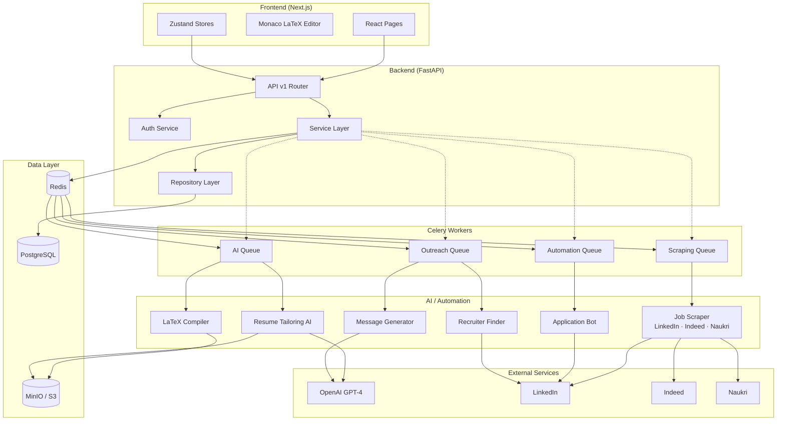
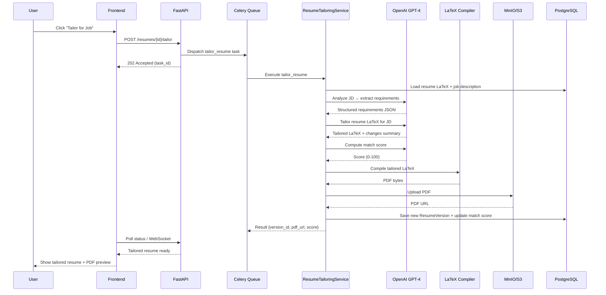
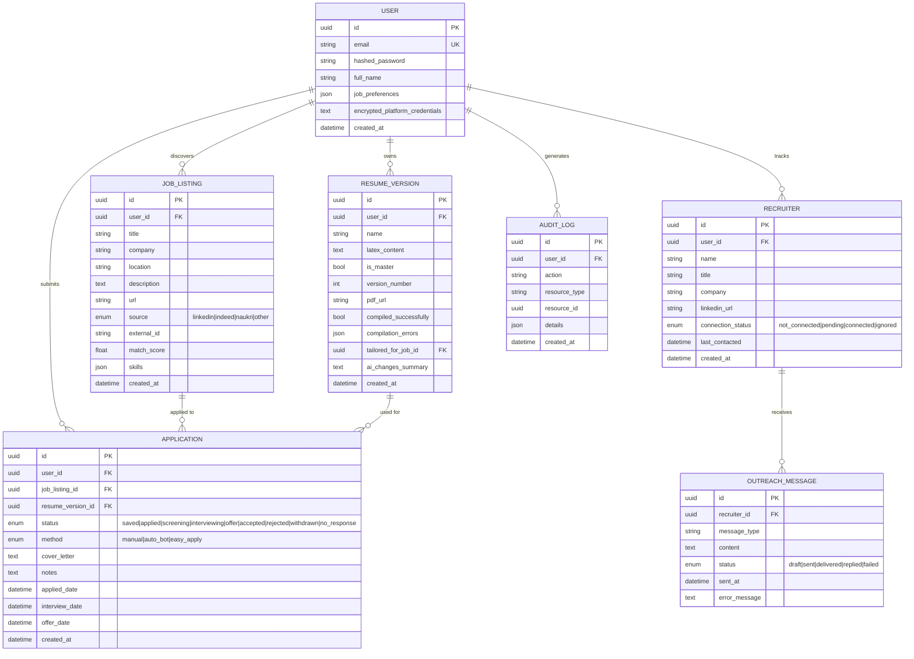
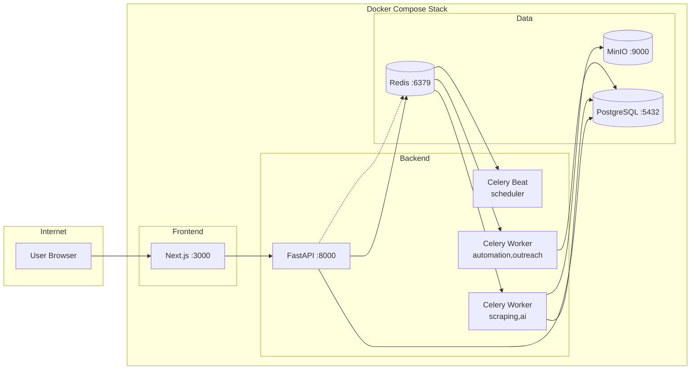
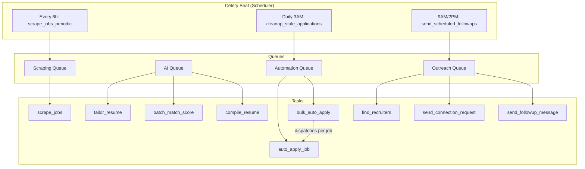

# HirePilot — System Architecture Diagrams

## 1. High-Level System Architecture

## 2. Request Flow — Resume Tailoring Pipeline

## 3. Entity Relationship Diagram

## 4. Deployment Architecture

## 5. Celery Task Flow

